# K-SPICE API - Setup Tutorial

This guide will help you set up everything you need to start working with the **K-SPICE API**.  
> **Note:** This tutorial assumes that **K-SPICE** is already installed on your system.

## Table of Contents

1. [Python Installation](#step-one---install-python)
2. [Package Installation in Python](#step-two---package-installation)
3. [Setting up Visual Studio Code Editor](#step-three--set-up-visual-studio-code-editor)
4. [Folder Structure](#step-four--folder-structure)
5. [Configuration of Path variables](#step-five--configure-path-variables)
6. [Test Run](#step-six--do-a-test-run)
7. [Useful Resources](#useful-resources)


---

## Step One - Install Python 

Before downloading Python, it is important to verify that you have the necessary package on your device and determine which Python version is compatible with it.

### Verifying the K-Spice API Package

First, we need to verify that the **K-Spice API package** is located in the `bin64` folder.

In the screenshot below, we can see the following file:

`
kspice.cp312-win_amd64
`

This filename provides useful information:

- **`cp312`**: Indicates compatibility with **Python 3.12**.
- **`win_amd64`**: Specifies that the package is intended for **64-bit Windows systems**.

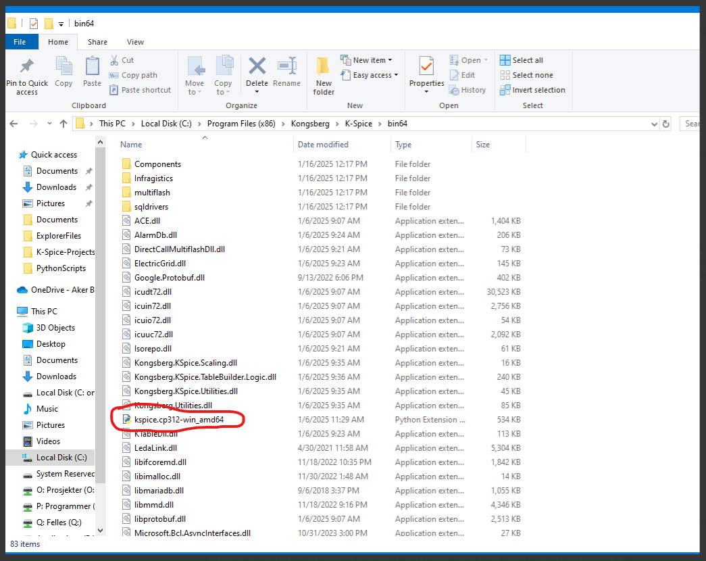

Based on the information we’ve gathered above, we need to install Python 3.12. After speaking with people at Kongsberg, they recommended installing version 3.12.10. I’m not entirely sure why, but I assume that any 3.12 version should work.

We therefore start by installing [Python version 3.12.10](https://www.python.org/downloads/release/python-31210/).

Make sure to select the correct installer for your system, as shown below:


Double-click the downloaded file. You should see a window like this:

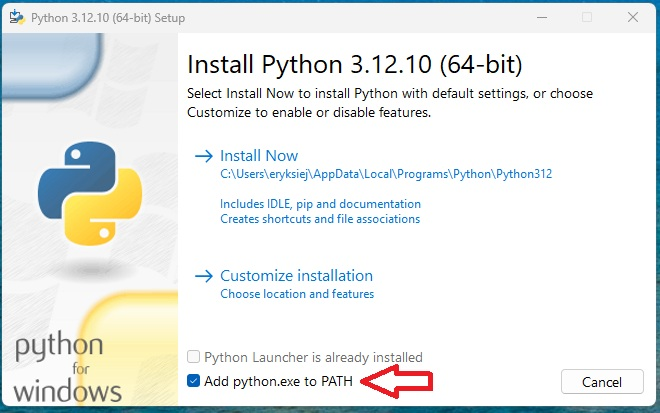

Chcek the `Add python.exe to PATH` and then click on `Customize installation` and check the boxes for:

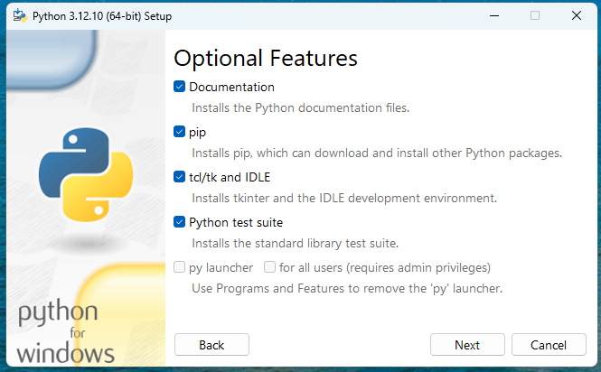

Click on "Next" and then click `Install` to complete the installation:

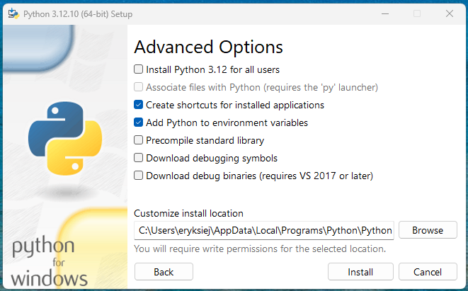

---

## Step Two - Package Installation 

Before using the K-SPICE API, you’ll need some extra Python tools (called "packages") that help with data handling, math, and plotting. 

### First, open the Command Prompt window by either:

- Typing `cmd` in the Windows search bar and pressing **Enter**, or  
- Pressing **Windows key + R**, typing `cmd`, then pressing **Enter**

If done correctly a window similar to this should pop up on your screen: 


#### Installing `pip`

`pip` is a tool that lets you download and install other useful Python packages. It usually comes with Python, but if it’s missing, you can install it by running:

```bash
python -m ensurepip --upgrade

```

#### Then, install the packages:

```bash
python -m pip install matplotlib numpy pandas datetime
```

This will install:

- `matplotlib` – for creating plots and graphs
- `numpy` – for working with numbers and arrays
- `pandas` – for handling data tables and CSV files
- `datetime` – for handling timelines

You can always come back to this step and install more packages later using the same format:

```shell
python -m pip install <library-name>
```


## Step Three – Set up Visual Studio Code editor


To run your Python scripts, you need to install an environment that supports Python execution.

I recommend using **Visual Studio Code (VS Code)**, and I’ll quickly guide you through how to set it up. However, feel free to use any environment you prefer — if you already have a favorite, go for it!

#### Why VS Code?
- Lightweight and fast
- Great Python support with extensions
- Built-in terminal and debugger
- Works on Windows, macOS, and Linux

You can **Download and install VS Code** [here](https://code.visualstudio.com/download).

This should be pretty straightforward — just follow the necessary steps in the *VS Code installer*, however if you struggle check out this [video](https://youtu.be/cu_ykIfBprI?feature=shared).

Once the installation is complete and you open the application:

1. Go to the **Extensions** tab (you can also press `Ctrl+Shift+X` on your keyboard)

2. In the search bar, type **"Python"**

3. Look for the extension published by **Microsoft** and click **Install**

The screenshot below shows where to find the Extensions tab and which Python extension to install:


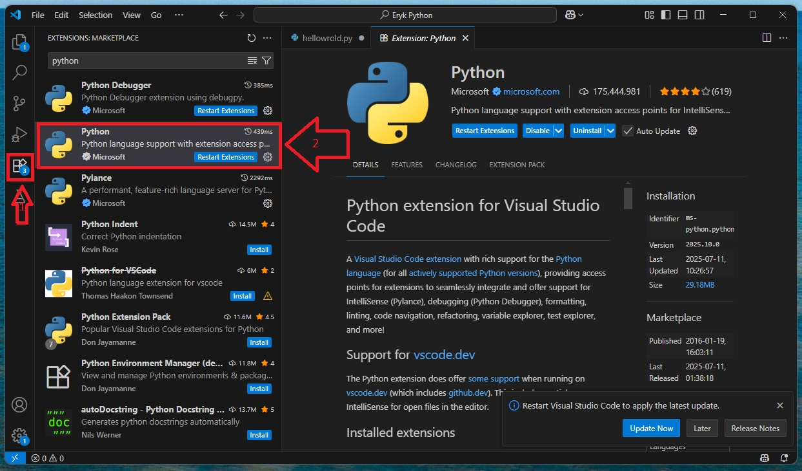

## Step Four – Folder Structure 

If you have used K-Spice before without the API you probably have this step completed, however for first time users make sure that you store your project files in a proper way that K-spice easliy can read them.

Create a folder on your **C: drive** with any name you like.  
In the screenshot below, you’ll see I named mine **K-Space-Projects** — this is just to illustrate that you can choose whatever name suits you.

Keep all your **K-Spice projects** organized inside this folder.


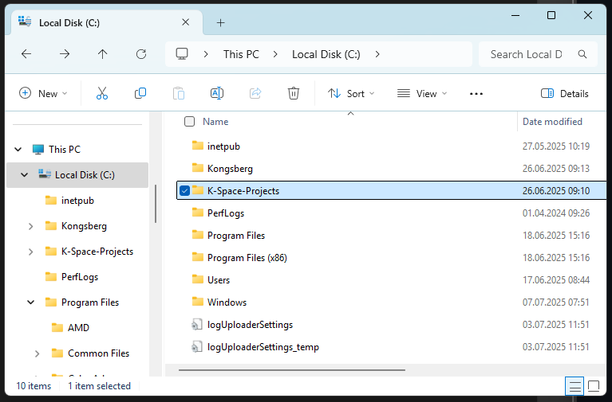

Just remember to specify in **K-Spice Sim Explorer** which folder you’re using to store your projects:

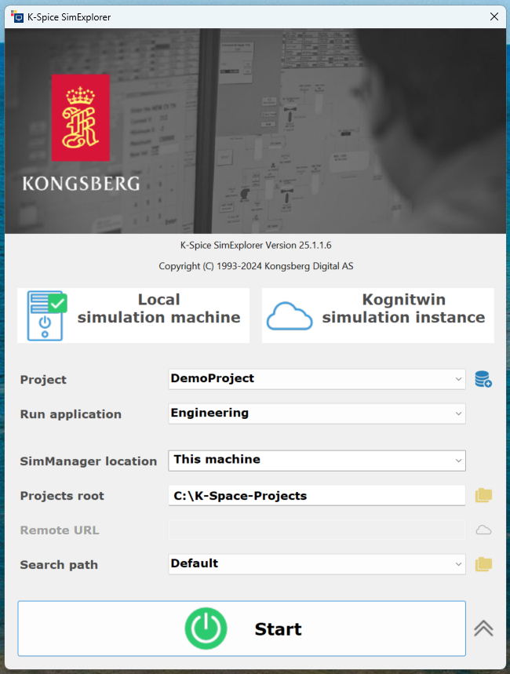


## Step Five – Configure Path Variables

Open up the search bar in windows and type in "edit enviroment variables for your account" and open it. A window like this should pop up: 

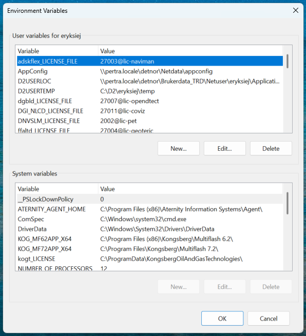

We need to add a new user variable, therefore press "New..." and name the variable "PYTHONPATH". Next, copy and paste the line below in the "Variable value" field:

```shell
C:\Program Files (x86)\Kongsberg\K-Spice\bin64
```
It should look like this:

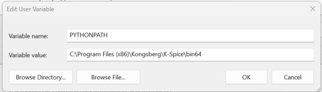

## Step six – Do a test run.

Use the code below to. If it compiled Congratulations you can start with the K-Spice API

```python
# Importing necessary libraries
import pandas as pd
import numpy as np
from datetime import timedelta
import csv
import kspice

# Version Check
print("KSPICE version:", kspice.__version__)

# Path for project folder 
sim = kspice.Simulator(r"C:\K-Spice-Projects\DemoProject") 

# Activvating the timeline
tl = sim.timelines[0]
tl.activate()

# Load models, parameters, initial_conditions 
tl.load("KSpiceTutorial Model", "KSpiceTutorial Model", "Steady_state")

# Run timeline for 120 seconds 
sim_time = timedelta(seconds=120)
tl.run_for(sim_time)

# Deactivate the timeline
tl.deactivate()

# Close project 
sim.close_project()
```

If you get an error stating that the K-Spice library is not found, try including it this way: 

```python

import sys
sys.path.append(r"C:/Program Files (x86)/Kongsberg/K-Spice/bin64")
import kspice
```

## Useful Resources 

This chapter provides a brief overview of the available resources and explains how to use the API effectively.

1. [Official Documentation](#official-documentation)
2. [Useful Github pages](#useful-github-pages)
3. [Running Code in Debug Mode](#running-code-in-debug-mode)
4. [Example Code](#example-code)
---
### Official Documentation

First of all, you can find the official K-Spice documentation [here](https://akerbp.sharepoint.com/:f:/s/E2EProductionOptimizationAutomatedwellcontrol/Eo5NKqmLq5tErv02UsjdYksB1yE4VbWZFjLQCPJPQQWRUg?e=yiTFJr).
Download the folder to your device to view the contents. Please note that this documentation is not publicly available.

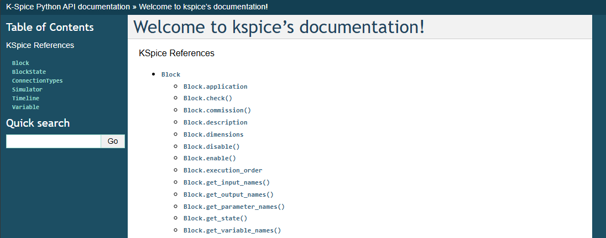

### Useful Github pages: 

K-Spice Architecture and example code from Kongsberg Digital: [K-Spice Python API](https://github.com/JonathanNees/K-SpicePython/tree/main).

Framework for orchestrating and automating simulation workflows in the Yggdrasil Engineering Simulator: [YggSimLib](https://github.com/h-enerst/YggSimLib).

---

### Running Code in Debug Mode: 

Using debug mode in VS Code while running your code can be extremely helpful.
It allows you to set breakpoints where the execution will automatically pause, giving you a chance to inspect variables and step through the code before continuing.
You can access debug mode by clicking the **Run and Debug** icon on the left sidebar in VS Code. See the screenshot below for reference.

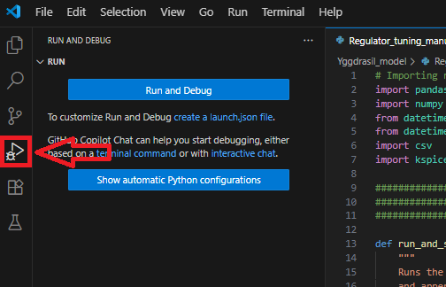

To set a breakpoint in VS Code, hover your mouse over the left margin next to the line of code you want to pause at, and click to place the breakpoint.
When you run your code in debug mode, execution will stop right before that line, allowing you to inspect variables and confirm when you're ready to continue.

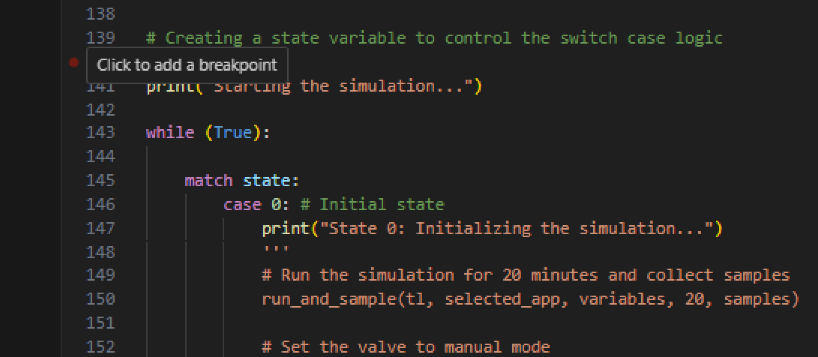

Once you’ve selected the breakpoints you want, click on “Run and Debug” in the left sidebar (the play icon with a bug).
This will open a dropdown menu at the top of the window—choose “Python Debugger” from the list to start the debugging session.
Your code will now run and automatically pause at the breakpoints you’ve set, allowing you to inspect variables and step through the execution.

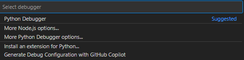

While running your Python script—especially in debug mode—it can be very useful to monitor what’s happening in real time in K-Spice.
To do this, open SimExplorer, where you’ll find an option to connect to the simulation.
By clicking Connect, you’ll be linked to the active session that your Python script has started, allowing you to observe the model as it runs.

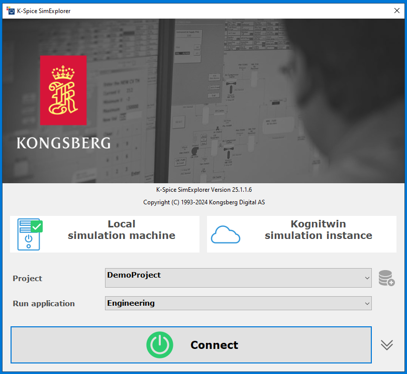

---

### Example Code: 
Below are code examples demonstrating basic tasks such as running step responses and plotting data from CSV files: 

1. [Plotting from CSV file](https://github.com/eryksiejka47/K-Spice-API-set-up/blob/1aff5b22a0a3b9e4937f39baf6b7efca55651b2a/Examples/plotting.py)
2. [Step Response - Switch Case Structure](https://github.com/eryksiejka47/K-Spice-API-set-up/blob/c1537602b9b8fa667baa5a8032770dfdca1ae8be/Examples/Step_Switch_Case.py)


