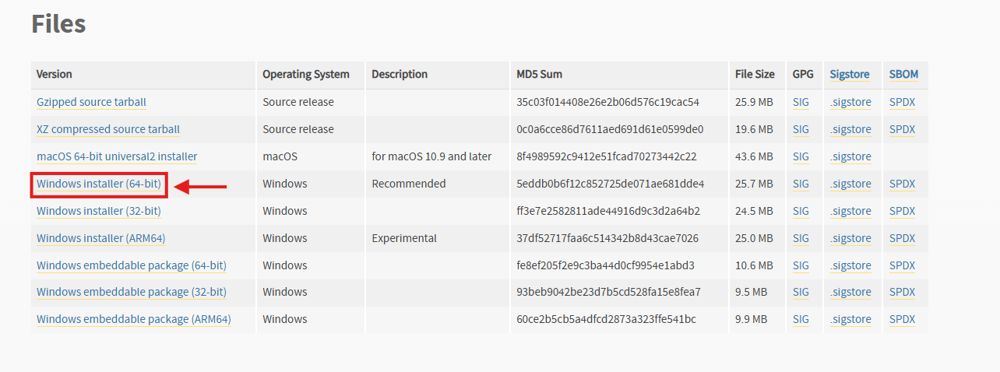
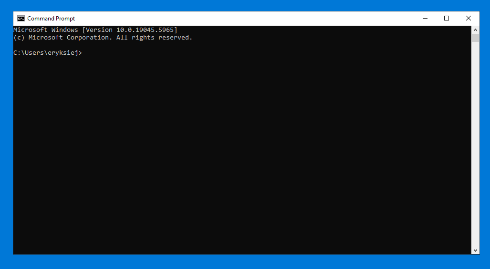

# K-SPICE API - Setup Tutorial

This guide will help you set up everything you need to start working with the K-SPICE API.

---

## Table of Contents

1. [Step One – Install Python](#step-one---install-python)
2. [Step Two Package Installation](#step-two-package-installation)
3. [Step Three – Set up Visual Studio Code editor](##step-three---set-up-visual-studio-code-editor)


## Step One - Install Python 

To get started, you’ll need to install **Python version 3.12.10**.

👉 https://www.python.org/downloads/release/python-31210/


Make sure to choose the correct installer as shown below:



After the download open up the installation, make sure Add to Path is checked on and follow through with the installation. 

---

## Step Two Package Installation 

Before using the K-SPICE API, you’ll need some extra Python tools (called "packages") that help with data handling, math, and plotting. 
### First, open the Command Prompt window by either:

- Typing `cmd` in the Windows search bar and pressing **Enter**, or  
- Pressing **Windows key + R**, typing `cmd`, then pressing **Enter**

If done correctly a window similar to this shoudl pop up on your screen: 



#### Installing `pip`

`pip` is a tool that lets you download and install other useful Python packages. It usually comes with Python, but if it’s missing, you can install it by running:

```bash
python -m ensurepip --upgrade

```


#### Then, install the packages:

```bash
python -m pip install matplotlib numpy pandas datetime
```

This will install:

- `matplotlib` – for creating plots and graphs
- `numpy` – for working with numbers and arrays
- `pandas` – for handling data tables and CSV files
- `datetime` – for handling timelines

You can always come back to this step and install more packages later using the same format:

```shell
python -m pip install <library-name>
```

## Step Three – Set up Visual Studio Code editor

👉https://code.visualstudio.com/download
## Step Four – Configure Path Variables


## Step Five – Do a test run.

copy paste this code (add code the user can copy paste) and check if it compiles. If it compiled Congratulations you can start with the K-Spice API
